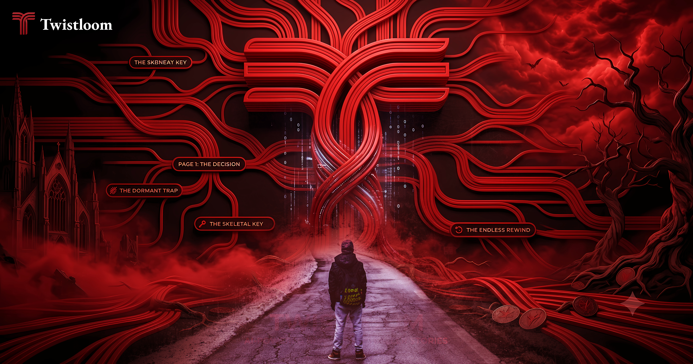

<!-- ═══════════════════════════════════════════════════════════ -->
<!--                      HEADER WAVE                          -->
<!-- ═══════════════════════════════════════════════════════════ -->


<!-- ═══════════════════════════════════════════════════════════ -->
<!--                    TYPING ANIMATION                        -->
<!-- ═══════════════════════════════════════════════════════════ -->
<div align="center">

<div style="background: #0d1117; border: 1px solid #30363d; border-radius: 10px; padding: 16px; padding-bottom: 0; color: #c9d1d9;">

[](https://git.io/typing-svg)

</div>

</div>

<br/>

<!-- ═══════════════════════════════════════════════════════════ -->
<!--                      ABOUT ME                             -->
<!-- ═══════════════════════════════════════════════════════════ -->

<table style="margin-left: -100px">
  <tbody>
    <tr>
      <td></td>
      <td><h3 style="margin-left: -50px">Professional software engineer specializing in mobile and web application development. A Flutter enthusiast. I've developed & published many apps on Play Store and Twistlom... soon.</h3></td>
    </tr>
  </tbody>
</table>

- 👨‍💼 CEO & Founder of **TARRA Soft**.

- 👨‍💻 Want to see my Portfolio & CV? Check out [My LinkedIn](https://www.linkedin.com/in/taufik-nur-rahmanda/) and [My Website (Pure HTML & Experimental CSS, 100/100 Performance)](https://txufiknr.pages.dev/).

- 👀 I'm currently enthusiastic about **Twistloom**

- 💬 Ask me about **AI**, **React**, **Flutter**, or **anything** you want to know

- 🩸 Visit my **Twistloom** platform: https://twistloom-web.vercel.app

<!--  -->
<table style="margin-bottom: -10px">
  <tr>
    <td valign="bottom" width="25%">
      
    </td>
    <td valign="center" width="75%">
      
      
      
      
      
      
      
      
      
      
      
      
      
      
      
      
      
      
      
      
      
      
      
      
      
      
      
      
      
      
    </td>
  </tr>
</table>

```typescript
const taufik = {
  role:       "Full-Stack Developer · AI/LLM Engineer",
  flagship:   "Twistloom — AI-powered psychological horror interactive fiction",
  obsession:  "Turning narrative design theory into production AI systems",
  stack:      ["Next.js 16", "React 19", "TypeScript 6", "Express", "PostgreSQL", "Redis"],
  ai:         ["gemini","mistral","openai","cohere v2","groq","cerebras","nvidia nim","github models","openrouter","cloudflare worker","jina","hugging face inference"],
  also:       ["Flutter mobile dev", "Founder of TARRA Soft"],
  currently:  "Architecting narrative engines that haunt you 🩸",
};
```

<br/>

<!-- ═══════════════════════════════════════════════════════════ -->
<!--                    TECH STACK                             -->
<!-- ═══════════════════════════════════════════════════════════ -->


<br/>

<!-- ═══════════════════════════════════════════════════════════ -->
<!--                  FEATURED PROJECT                         -->
<!-- ═══════════════════════════════════════════════════════════ -->

## 🩸 Featured Project

<div align="center">

<table>
<tr>
<td>

</td>
<td>

<p align="left" style="font-family: Georgia, Cambria, 'Times New Roman', Times, serif; font-size: 32px; font-weight: bold; margin-bottom: 0">
  Twistloom
</p>

</td>
</tr>
</table>

[](https://twistloom-web.vercel.app)
[](https://twistloom-web.vercel.app)
[](https://twistloom-web.vercel.app)

</div>

<div style="background: #0d1117; border: 1px solid #30363d; border-radius: 10px; padding: 16px; margin-bottom: 20px; color: #c9d1d9;">

<p align="center" style="font-family: Georgia, Cambria, 'Times New Roman', Times, serif; font-size: 16px; font-weight: 500; margin-bottom: 0; text-align: center; color: red">
  An AI-powered psychological horror interactive fiction platform. The story adapts to every choice — powered by a multi-LLM waterfall, narrative momentum engine, and adaptive health systems.
</p>

</div>

<a href="https://twistloom-web.vercel.app" target="_blank">

</a>

<br/>

<!-- ═══════════════════════════════════════════════════════════ -->
<!--                    GITHUB STATS                           -->
<!-- ═══════════════════════════════════════════════════════════ -->

## 📊 GitHub Stats

<div align="center">

<table>
<tr>
<td>

  

</td>
<td>

  

</td>
</tr>
</table>

</div>

<div align="center">
  
</div>

<br/>

<!-- ═══════════════════════════════════════════════════════════ -->
<!--               CONTRIBUTION SNAKE                          -->
<!-- ═══════════════════════════════════════════════════════════ -->

## 🐍 Contribution Graph

<div align="center">
  
</div>

<!-- 
  ⚙️  To enable the snake, add this GitHub Action to your repo:
  .github/workflows/snake.yml
  
  name: Generate Snake
  on:
    schedule: [{ cron: "0 0 * * *" }]
    workflow_dispatch:
  jobs:
    generate:
      runs-on: ubuntu-latest
      steps:
        - uses: Platane/snk@v3
          with:
            github_user_name: txufiknr
            outputs: |
              dist/github-contribution-grid-snake.svg
              dist/github-contribution-grid-snake-dark.svg?palette=github-dark
        - uses: crazy-max/ghaction-github-pages@v3
          with:
            target_branch: output
            build_dir: dist
          env:
            GITHUB_TOKEN: ${{ secrets.GITHUB_TOKEN }}
-->

<br/>

<!-- ═══════════════════════════════════════════════════════════ -->
<!--                  PROFILE VIEWS                            -->
<!-- ═══════════════════════════════════════════════════════════ -->

<div align="center">


[](https://github.com/txufiknr)

</div>

<!-- ═══════════════════════════════════════════════════════════ -->
<!--                    FOOTER WAVE                            -->
<!-- ═══════════════════════════════════════════════════════════ -->


<!-- 
  ────────────────────────────────────────────────────────────
  SETUP CHECKLIST — replace before publishing:
  
  [ ] Add the snake GitHub Action (see comment above snake section)
  [ ] Verify github-readme-stats works for private repos 
      (add &count_private=true and make sure token is set)
  ────────────────────────────────────────────────────────────
-->